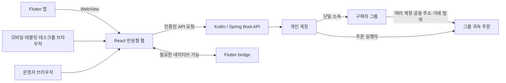
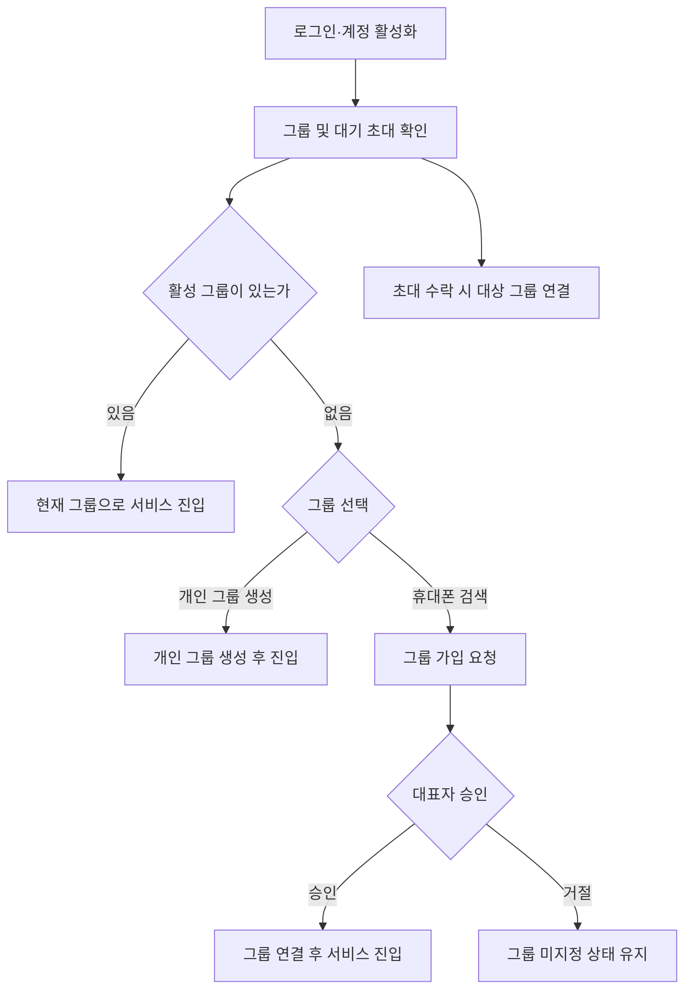

# 엄지마켓 Web

React 기반 판매·운영 화면. 앱에서는 Flutter WebView로, 웹에서는 브라우저로 제공하며 모바일·태블릿·데스크톱을 지원하는 반응형 서비스로 구성.

## 전체 연결 구조

화면과 API 계약은 앱·브라우저에서 공유함. Flutter bridge는 카메라·파일 등 웹만으로 처리하기 어려운 네이티브 기능에 한해 사용. 화면별 권한은 서버 API에서 다시 검사.

## 회원 진입과 그룹

1. 앱과 브라우저 모두 휴대폰 번호를 계정 식별자로 사용.
2. 앱의 현재 회원 진입은 휴대폰 인증 기반. 브라우저는 휴대폰 번호 ID와 별도 비밀번호로 진입하는 방향이며, 최초 비밀번호 설정·복구 본인 확인 정책은 미구현.
3. 인증 후 계정 상태를 확인하고, 필요한 개인정보 동의·프로필 입력·운영 검토 단계를 안내.
4. 계정은 구매자 그룹 하나에 소속되고 그룹에는 여러 계정이 소속될 수 있음. 그룹 미지정 계정은 개인 그룹을 만들거나 기존 그룹 가입을 요청하는 onboarding을 거침.
5. 사업자번호는 그룹 소속의 필수 조건이 아님. 사업자 업체, 사업자번호가 없는 업체, 개인 구매 그룹을 지원.
6. 주문은 주문 실행 계정과 구매자 그룹에 함께 귀속. 그룹 구성원은 그룹 범위 주문·공용 배송지·거래 이력을 조회하고 주문자는 휴대폰 번호 일부로 구분.

현재 인증·계정·그룹 정책과 Mermaid 흐름: [`SERVICE_FLOW.md`](../SERVICE_FLOW.md). API 그룹 계약 및 권한 세부 기준: [`umji-market-api/docs/services/account.md`](../umji-market-api/docs/services/account.md).

Access Token은 메모리에 보관하고 Refresh Token 기반 세션 갱신·계정 상태 재검증을 수행. 세션 만료, 외부 결제 복귀, 파일 업로드, 앱 뒤로가기 흐름은 각 기능의 API·Flutter bridge 계약에 맞춰 관리.
